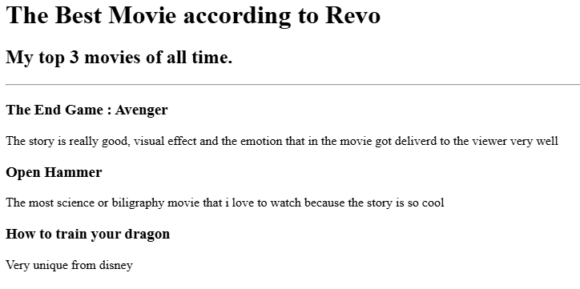

# Proyek Portofolio HTML Sederhana

Ini adalah proyek portofolio web yang dibuat sepenuhnya menggunakan HTML. Proyek ini berfungsi sebagai demonstrasi keahlian dasar pengembangan web dan menampilkan beberapa contoh proyek HTML lainnya.

## 📜 Deskripsi

Proyek ini merupakan sebuah situs web portofolio pribadi yang menampilkan profil singkat, daftar proyek yang telah dikerjakan, serta informasi kontak. Tujuannya adalah untuk menyediakan sebuah "hub" pusat yang dapat diakses oleh siapa saja untuk melihat hasil karya dan menghubungi pemilik portofolio.

## ✨ Fitur

- **Halaman Utama (`index.html`)**: Halaman selamat datang yang berisi judul portofolio dan navigasi ke proyek-proyek utama.
- **Proyek Peringkat Film (`public/movie-ranking.html`)**: Sebuah halaman yang menampilkan daftar film favorit.
- **Proyek Undangan Ulang Tahun (`public/birthday-invite.html`)**: Contoh halaman undangan ulang tahun yang kreatif.
- **Halaman Tentang Saya (`public/about.html`)**: Halaman yang berisi deskripsi singkat mengenai diri Anda.
- **Halaman Kontak (`public/contact.html`)**: Menyediakan informasi kontak untuk keperluan profesional.

## 📂 Struktur Proyek

```
.
├── assets
│   └── images
│       ├── birthday-invite.png
│       ├── movie-ranking.png
│       └── Profile.JPG
├── public
│   ├── about.html
│   ├── birthday-invite.html
│   ├── contact.html
│   └── movie-ranking.html
├── goal.png
├── index.html
└── solution.html
```

- **`index.html`**: File utama yang menjadi gerbang portofolio.
- **`public/`**: Direktori yang berisi semua halaman pendukung seperti "about", "contact", dan halaman proyek.
- **`assets/`**: Direktori untuk menyimpan aset statis seperti gambar.

## 🚀 Cara Menjalankan

Untuk melihat proyek ini, Anda tidak memerlukan server web. Cukup buka file `index.html` langsung di browser pilihan Anda.

1.  Clone atau unduh repositori ini.
2.  Buka file `index.html` di browser Anda (misalnya, Google Chrome, Firefox, atau Safari).
3.  Navigasi melalui link yang tersedia untuk melihat semua halaman.

## 🛠️ Teknologi yang Digunakan

- **HTML5**: Seluruh struktur dan konten situs web ini dibangun menggunakan HTML5.

## 🖼️ Tampilan Proyek

Berikut adalah beberapa tangkapan layar dari proyek ini:

### Halaman Peringkat Film


### Halaman Undangan Ulang Tahun


---

Dibuat dengan ❤️ oleh Revo Rahmat
